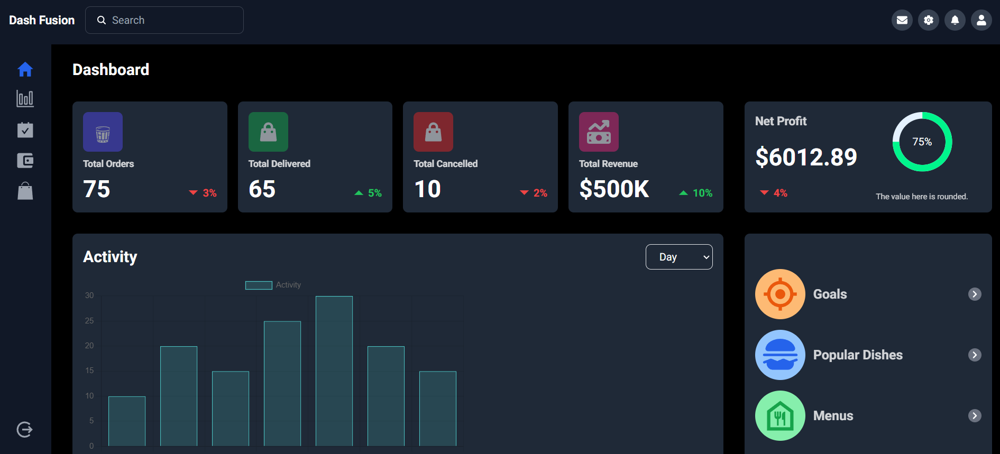
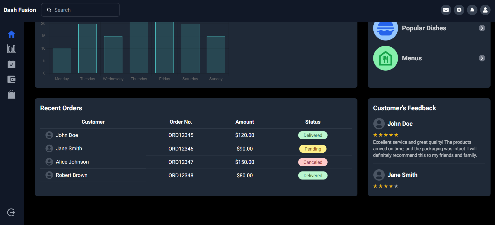

# Dash Fusion

Dash Fusion is a comprehensive and responsive dashboard application built with modern web technologies. It provides a clean and intuitive interface for managing various aspects of your data. The application includes features such as user management, analytics, order tracking, customer feedback, and more. Designed for flexibility and scalability, Dash Fusion is suitable for a wide range of applications and can be easily customized to meet your specific needs.

## Features

- **Dashboard Overview**: Provides a summary of key metrics and performance indicators.
- **Sidebar Navigation**: Easy access to different sections like Home, Profile, Settings, and Logout.
- **Dashboard Stats**: Displays total orders, total delivered, total canceled, and total revenue.
- **Activity Graph**: Interactive bar graph to visualize data over different time periods (day, week, month).
- **Customers Feedback**: Showcases customer feedback with ratings and messages.
- **Recent Orders**: Lists recent orders with customer icons, order numbers, amounts, and statuses.
- **Goals and Popular Dishes**: Highlights key goals and popular menu items with icons and descriptions.

## Technologies Used

- **React**: JavaScript library for building user interfaces with reusable components.

- **Next.js**: React framework for server-side rendering and static site generation.

- **Tailwind CSS**: Utility-first CSS framework for rapid UI development.

- **TypeScript**: Typed superset of JavaScript that enhances code quality and developer productivity.

- **react-icons**: Library for including popular icons in React projects.

- **Chart.js**: Simple yet flexible JavaScript charting library.

- **react-chartjs-2**: React wrapper for Chart.js to create responsive and customizable charts.

## How to Install and Run Locally

This project is built with Next.js. Follow the steps below to install and run the project locally:

1. **Clone the repository:**

   ```bash
   git clone https://github.com/amankashyap004/dash-fusion.git
   ```

2. **Navigate to the project directory:**

   ```bash
   cd dash-fusion
   ```

3. **Install dependencies:**

   ```bash
   npm install
   ```

4. **Run the development server:**
   ```bash
   npm run dev
   ```
   Open [http://localhost:3000](http://localhost:3000) in your browser to see the application.

## Screenshots

Visual representation of the Dash Fusion dashboard, showcasing various features and components.





## Live Demo

Check out the live demo of Dash Fusion **[Here](https://dash-fusion.vercel.app/)**. Click the link to explore the fully functional application.

## Folder Structure

The project follows a well-organized folder structure to keep the codebase maintainable and scalable:

```
DASH-FUSION/
├── .next/
├── node_modules/
├── public/
│   ├── images/
│   │   ├── all images
├── src/
│   ├── app/
│   │   ├── favicon.ico
│   │   ├── globals.css
│   │   ├── layout.tsx
│   │   └── page.tsx
│   ├── components/
│   │   ├── dashboard/
│   │   │   ├── ActivityGraph.tsx
│   │   │   ├── CustomersFeedback.tsx
│   │   │   ├── Dashboard.tsx
│   │   │   ├── DashboardHome.tsx
│   │   │   ├── DashboardStats.tsx
│   │   │   ├── DashboardSummary.tsx
│   │   │   ├── NetProfit.tsx
│   │   │   └── RecentOrders.tsx
│   │   ├── ui/
│   │   │   ├── CircularProgressBar.tsx
│   │   │   └── StarRating.tsx
│   │   ├── Footer.tsx
│   │   ├── Header.tsx
│   │   └── Sidebar.tsx
│   ├── mock/
├── .eslintrc.json
├── .gitignore
├── next.config.mjs
├── package-lock.json
├── package.json
├── postcss.config.mjs
├── README.md
├── tailwind.config.ts
└── tsconfig.json
```

- `.next/`: Auto-generated directory by Next.js containing build files.
- `node_modules/`: Directory containing project dependencies.
- `public/`: Static files and images.
- `src/app/`: Main application files, including global styles and layout components.
- `src/components/`: Reusable components such as Sidebar, DashboardStats, ActivityGraph, etc.
- `src/mock/`: Mock data for testing and development.
- **Project configuration files**: ESLint, TailwindCSS, TypeScript, and Next.js configurations.

## Future Enhancements

- **Animated Numbers on Page Load**: Implement animations for key metrics and statistics when the page loads.
- **Table with Filter Section**: Add a table component with filtering capabilities for better data management.
- **User Authentication**: Implement user authentication and save user data.
- **Backend Integration**: Integrate backend services and manage data in a database.
- **UI/UX Enhancements**: Continuously improve the user interface and user experience to make the application more user-friendly and visually appealing

Feel free to contact me for any queries or suggestions.
